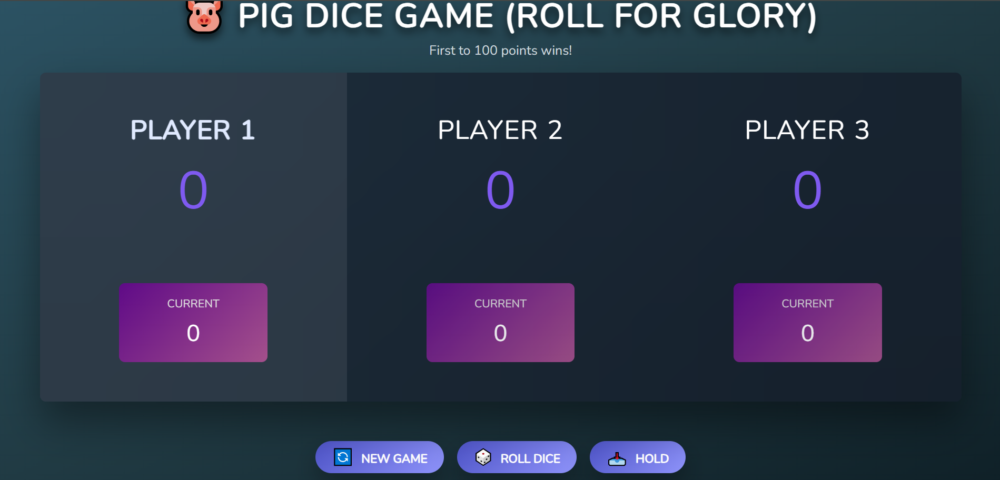
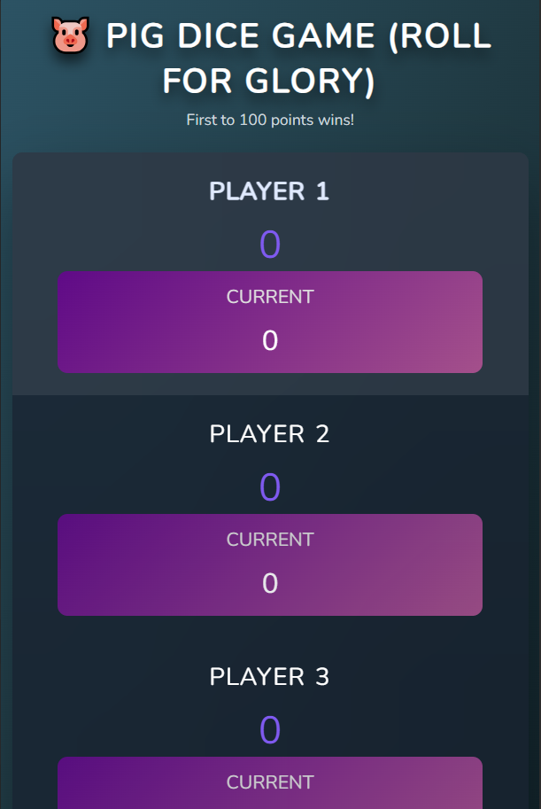

# 🐷 Pig Dice Game | Roll for Glory

A fun and interactive **multiplayer dice game** where the first player to reach **100 points** wins!  
Built with **HTML, CSS & JavaScript**, this game supports **three players**, smooth animations, and a vibrant dark theme for an engaging experience.

---

## 🎨 Features

- 🎲 Three-player gameplay
- 🏆 First to 100 points wins
- 🎮 Roll dice, hold current score, or start a new game
- ✨ Smooth animations for dice rolls and score updates
- 🌌 Dark gradient theme with neon highlights
- 🧼 Semantic, maintainable, and responsive code

---

## 🛠️ Built With

| Technology    | Purpose                            |
| ------------- | ---------------------------------- |
| 🧱 HTML5      | Page structure                     |
| 🎨 CSS3       | Styling, layout, responsive design |
| ✨ JavaScript | Game logic and interactivity       |
| 🖼️ Images     | Dice images for game rolls         |

---

## 📸 Screenshot

  

---

## 🌐 Live Demo

🌐 **Netlify Live Demo:**
[https://a-multiplayer-pig-game.netlify.app](https://a-multiplayer-pig-game.netlify.app)

---

## 📧 Let's Connect

🔗 **LinkedIn:**  
[https://www.linkedin.com/in/gaurav-lad1974](https://www.linkedin.com/in/gaurav-lad1974)

📨 **Email:**  
gauravlad1974@gmail.com
